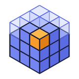

<p align="center">
  
</p>

<h1 align="center">BlockCompanion</h1>

<p align="center">
  A light schematic mod for building in Minecraft: ghost blocks, Create-style placement, layers and a resource list,<br>
  with a clean view. The in-game companion to BlockDesigner.
</p>

<p align="center">
  <a href="https://github.com/doolecg/BlockCompanion/releases/latest"></a>
  <a href="https://github.com/doolecg/BlockCompanion/releases"></a>
  <a href="LICENSE"></a>
  
  
</p>

---

BlockCompanion shows a schematic in your world as ghost blocks so you can build it. It does what
[Litematica](https://modrinth.com/mod/litematica) does for placing and checking a build, with less on screen and
simpler controls. It reads the schematics [BlockDesigner](https://github.com/doolecg/BlockDesigner) (the Windows
editor for Minecraft builds) saves, whole projects included, and saves builds from the world back as `.schem` files
BlockDesigner opens. With BlockDesigner's BlockCompanion Plugin it links live: send the project you're working on
into the game, see the game follow your edits, and see in the app what is built and what your chests hold.

It is a client mod for **Fabric** and **NeoForge** on **Minecraft 1.21.1, 26.2 and 26.3**, plus a
**Paper** plugin (Paper 1.21.1) for servers without mods. It is in early development; the [plan](docs/plan.md) lists
what comes next.

**Contents:** [Download](#download-and-install) · [Features](#features) · [Building from source](#building-from-source) · [Project layout](#project-layout)

## Download and install

Get the latest version from the [releases page](https://github.com/doolecg/BlockCompanion/releases/latest). Every
release has one jar per loader and Minecraft version:

| File | For |
|---|---|
| `blockcompanion-fabric-1.21.1-<version>.jar` | Fabric, Minecraft 1.21.1 (needs [Fabric API](https://modrinth.com/mod/fabric-api)) |
| `blockcompanion-neoforge-1.21.1-<version>.jar` | NeoForge, Minecraft 1.21.1 |
| `blockcompanion-fabric-26.2-<version>.jar` | Fabric, Minecraft 26.2 (needs Fabric API) |
| `blockcompanion-neoforge-26.2-<version>.jar` | NeoForge, Minecraft 26.2 |
| `blockcompanion-fabric-26.3-<version>.jar` | Fabric, Minecraft 26.3 (needs Fabric API) |
| `blockcompanion-neoforge-26.3-<version>.jar` | NeoForge, Minecraft 26.3 |
| `blockcompanion-paper-<version>.jar` | Paper 1.21.1 servers (goes in `plugins`) |

1. Download the jar for your loader and Minecraft version.
   Or let BlockDesigner do it: BlockCompanion Plugin's **Install mod…** puts the right jar into a game's `mods` folder.
2. Put it in your `mods` folder.
3. Put your BlockDesigner projects (`.bdproj`) and schematics in `<game folder>/blockcompanion/schematics` (the folder
   is made the first time you start the game, and the load screen has an **Open folder** button).

- **Updates:** BlockCompanion checks this repository for a newer release when the game starts,
  says so in chat, and installs it from the settings screen's **Updates** tab when you quit the game. The check can be
  switched off there.

## Features

### Schematics

- **BlockDesigner's formats first:** BlockDesigner projects (`.bdproj`) and Sponge schematics (`.schem`, v2 and v3)
  are the main formats, so you don't need Litematica or Create files. Litematica (`.litematic`) and vanilla structure
  (`.nbt`) files still load. [Formats](docs/formats.md) explains the choice.
- **The schematic screen (B)** walks through four steps, each usable on its own:
  1. **Source:** every schematic in `blockcompanion/schematics` (subfolders included; projects and `.schem` files first,
     marked green), or on a BlockCompanion server the schematics and placements shared there. **Load** puts one just in
     front of you, **Unload** removes every copy of it from the world, **Delete** removes the file (after asking);
     **From BlockDesigner** asks the app for the project it has open.
  2. **Placement:** what is loaded in this world, where it is, how far it is built and whether it is locked, with lock
     presets (unlocked, position, in place, everything), show / hide, bring here, turn, mirror, follow BlockDesigner
     (Live), **Unload** and **Edit in BlockDesigner**.
  3. **Resources:** what the build still needs against your inventory and linked chests (the same list as **N**).
  4. **BlockDesigner:** the live link: off, waiting or connected (and to which app), the linked project, Start / Stop,
     Get project and Send now.
- **Locking:** so a schematic can't be knocked out of place: **Position**, **In place** (position, turning and
  mirroring) or **Everything** (the layer view too), from the Placement step or with **Y** on the box you look at. A locked box
  has a blue outline, and scrolling or **M** on it says what is locked.
- **Whole projects:** a `.bdproj` loads as one schematic: its visible layers merged, each with its own offset, rotation
  and mirror as in BlockDesigner. Hidden layers are left out. Hover a project in the list to see its layers.
- **Save from the world:** hold a **stick**, **Alt+left-click** one corner and **Alt+right-click** the opposite one (or
  press **K** on each; a cyan outline shows the box), then **O**, type a name and save. The stick never breaks or uses the block
  you click while selecting; another item can be the tool in the settings. It is written as a Sponge v3 `.schem` in the schematic folder, with chest contents, signs and entities, ready
  to open in BlockDesigner. Without marked corners, **O** saves the loaded schematic's box: what you have built so far.
  Look at the cyan box with the stick and **Shift+scroll** (in Move mode) to move the whole selection, the same way as a
  schematic's box; **Shift+right-click** with the stick clears it.
- **Saved per world:** every loaded schematic, where it is, how it's turned, the layer you're on and what's locked are
  kept for each world and server, and come back when you rejoin.

### A clean view

- Only what differs from the world: **near-solid ghosts** where a block is missing, **red**
  (tint and outline) over a different block (or the right block facing the wrong way), **orange** where something is
  in the way. Grass, flowers, water and snow don't count as being in the way.
- **Boxes only with the tool:** the schematic's bounding box and the save selection show while the selection tool (a
  stick by default) is in either hand, and fade out when you put it away. Each box has faint tinted faces that breathe
  slowly, the face you look at a little brighter, a crisp outline and light corner brackets; a locked box stays blue.
  **Show boxes** on the settings screen can keep them on always. Ghosts show either way.
- **The world replaces the ghost:** a cell with the right block shows nothing, and everything updates the moment a
  block is placed or broken, by you or anyone else.
- Ghosts look **almost like real blocks**: the game's own block models, lit by the world around them with ambient
  occlusion, at 85% opacity with a slight cool tint and a slow pulse that mark them as not built yet. Chests, signs,
  beds, banners, heads, shulker boxes, bells and lecterns show their real shapes, and water and lava their real
  surface. Your resource packs (and a server's) apply to the ghosts too, and they are rebuilt when the packs change.
- **Light on the game:** meshes are built per 16×16×16 section and rebuilt only when that part of the world or the
  placement changes, a few sections per frame, nearest first; sections out of view are skipped. Ghosts are drawn up to
  **64 blocks** away by default (**Ghost distance** in the settings, up to 256 or unlimited); the build is still counted
  everywhere. While AutoBuild places blocks, they arrive without sparkles, and the ghosts around them catch up a few
  times a second rather than on every block.
- **Two schematics on top of each other** (the same one loaded twice, say) are drawn and built twice: a line in chat
  says so once, so you can move or unload one.

### Building

- **Easy place** (on by default, **H** switches it): look at a ghost and right-click with its block to place exactly
  that block there, turned the right way (stairs, slabs, logs, doors, trapdoors, furnaces, observers...), even in
  mid-air. It sends the same click a player would, so it works in survival on vanilla and Paper servers. Without the
  block in hand it takes it from your inventory; on a BlockCompanion server (and in singleplayer) it fetches it from
  your linked chests. With nothing to place from, nothing is placed and a hint says what's needed. A BlockCompanion
  server can switch it off. It never clicks a cell that already holds a block or the same cell twice in a row, skips the
  upper half of doors and beds (it comes with the lower one), and holding right-click with a block doesn't keep
  flapping doors and trapdoors or opening chests inside a shown schematic.
- **Auto place** (off by default; switch it in the settings or with its key, which has none until you set one): the
  missing blocks within your reach place themselves, bottom layer first and nearest first, turned the right way, from
  the blocks you carry (hotbar and off hand, and the rest of the inventory when easy place may take from it). Only
  visible layers, only cells with a real block next to them, never over a wrong block, and never against a door, chest
  or other block that reacts to a click. It places 4 blocks a second by default (up to 20, one per tick; a
  BlockCompanion server's `autoPlaceBlocksPerSecond` and `autoPlaceRange` cap it) and leaves a cell alone for 2
  seconds after trying it. It pauses while a menu is open, in spectator, and while you hold something that isn't a
  block. The info panel shows "Auto place on" (or why it's paused). Servers can switch it off on its own.
- **Pick block** (middle click) on a ghost selects its item from your hotbar or inventory (in creative it makes one).
- **Info panel** in the bottom left, in the game's tooltip frame: the schematic, a bar that fills red, orange, yellow,
  green with how many blocks are left (and wrong), the current layer's own bar while you step through layers, the
  block in your hand with how many are left and how many your chests hold, and what is locked. Chunks you walked away
  from keep their last known state.
- **Crosshair hint:** small text just left of the crosshair, no background: what a wrong block should be ("Should be
  Oak Stairs · facing north"), or which block the ghost you look at is.
- **Tool panel** in the bottom right while the stick is in your hand, in the same frame as the info panel: the tool's
  mode, what it does, and the stick's controls (Shift+scroll, Ctrl+scroll, corners, clearing, linking chests).
- **Move and size the HUD** like Xaero's minimap: the HUD editor (from the settings screen's HUD tab) lets you drag the
  info panel, the hint and the tool panel anywhere, scroll or slide to size them, and switch any of them off. They keep to the side of the
  screen you put them on.
- **Material helper:** holding a block gently marks the nearest ghosts that need it and shows how many are left.
- **A little celebration:** a few quiet sparkles for each correct block (no sound), a low note for a wrong one you
  placed yourself (at most every few seconds), a toast and sparkles when a layer is done (and on to the next layer), and
  fireworks with a summary (time, blocks, accuracy) when the whole build is finished. Sounds follow the Blocks volume
  slider; each part can be switched off in the config.

### Placing (Create-style)

- Moving, turning and mirroring need the **selection tool** (a stick by default) in your hand, so scrolling through the
  hotbar never knocks a build out of place. Without it the scroll wheel works as usual. (The schematic list's buttons,
  such as Bring here, work either way; the Building tab can switch the rule off.)
- **Look at a box** (it turns yellow; the selected one is white) with the stick in hand, then **Shift+scroll** moves it
  one block per notch along the axis of the face you're looking at: scrolling up pushes it away from you, down pulls it
  closer. **Ctrl+scroll** turns it 90° (up clockwise). Plain scroll changes the hotbar as usual.
- The stick has two **modes** for Shift+scroll: **Move** and **Mirror** (any notch flips it). **Ctrl+Shift+scroll**
  switches between them; the tool panel shows the current one, and it is remembered. Turning works in either mode.
- **V** cycles the view of the schematic you look at (or the selected one): everything, layers up to here, this layer
  only, only this schematic, hidden, and back. A hidden schematic's box still shows while the stick is in hand, so the
  stick and the keys keep working on it.
- The **selection** (the cyan box) moves the same way: when it's the box you look at, Shift+scroll in Move mode
  shifts both corners together. When a schematic's box is also in view, the nearer one moves (one you see from outside
  wins over one you stand in; standing in both, the smaller). Turning and mirroring don't apply to the selection.
  **Shift+right-click** with the stick clears it, aimed at a block or not, and never opens or uses the block you click.
- **Ctrl+Z** undoes and **Ctrl+Y** or **Ctrl+Shift+Z** redoes, like any program: one history across every loaded
  schematic and the selection's moves, stepping back through moves, turns, mirroring, locks, layers and views in the order you made them, no
  stick needed. A new change clears what could be redone; a quick scroll counts as one step. Undo won't move a locked
  placement, and on a server a shared placement's undo is sent like any other move.
- **M** mirrors it (stick in hand). Stairs, doors, rails, fences, signs and other directional blocks turn and mirror with it.
- **Toggle keys** (none bound until you set one): show or hide the HUD, ghost shimmer, block entity ghosts, boxes
  always or only with the tool, and the material helper. Each flips the same option as the settings screen and saves it.
- Every key can be rebound in **Options › Controls › BlockCompanion** or on the settings screen's Keys tab. The stick's
  modifiers (Alt, Ctrl, Shift or off: for moving, turning, corners, clearing and linking) are on the Building tab, with
  the reach (see [Settings](#settings)).

### Layers

- **PgUp / PgDn** step through the levels of the box you look at (or the selected one), like BlockDesigner's slice view. By default levels **build up** (the current
  one and everything below it); **Insert** switches to **one level** at a time. While you're not seeing them all, the
  corner shows the current level and how far it is built. Finishing the current level steps to the next one.

### Resources

- **N** opens the list of every item the build needs (a loaded project counts its visible layers): how many, how many
  are **placed** already, how many you carry, how many your **linked chests** hold, and how many are **still to get**
  (needed − placed − carried − in chests), most still to get first. Each row has a bar that fills red to green as the
  item is covered. It follows the live progress, your inventory and your chests by itself; buttons pick the
  schematic, switch between the whole build and the visible layers, and **Refresh** counts again now. Hover a row for the amount in stacks and
  shulker boxes.
- **Linked chests:** hold the stick and **Ctrl+right-click** a chest (or barrel, shulker box...) to link it, again to
  unlink. What's inside is counted when you link it and each time you close it after opening it, and stays as it was
  until you open it again. What AutoBuild and easy place's restock take out comes off the count by itself. On a
  server without BlockCompanion only chests you open are counted. They count as materials here, in the info panel and in
  BlockCompanion Plugin. It counts items the way BlockCompanion Plugin does: a double slab
  is two slabs, a door one item, crops their seeds, wall torches torches.
- **AutoBuild:** when your linked chests hold everything a placement still needs, **Start AutoBuild** in the
  schematic screen's Resources step has the server build it for you, like Create's Schematicannon: block by block, each
  block's item taken out of your chests as it goes down. Hover the button to see what is short ("Short: 12 oak planks,
  3 glass"). In creative it needs no chests and takes nothing. Doors, beds and tall plants go down whole, as one item;
  anything that can't stand where it is (sand over a hole) is skipped. Like the Schematicannon it sets blocks without
  updating their neighbours, so water doesn't flow into a gap and redstone next to the build stays quiet while it
  works. It builds only in loaded chunks, pauses when an
  item runs out (refill a chest and press **Resume**), and shows "AutoBuild: 340 / 1,200" on the action bar and next to
  its **Pause** / **Resume** and **Stop** buttons. When it's done you hear a bell and read "AutoBuild finished: Castle
  (N placed, M skipped)". The **Options** button next to it sets how one build runs (they start from the defaults in
  Settings, AutoBuild section, and a change reaches a build that is already running):
  - **Speed:** blocks a second, 1 to 200 (5 by default); the server may allow less.
  - **Order:** **Bottom up** (layer by layer from the lowest, the default), **Top down** (blocks that need support
    below wait for one last bottom-up pass at the end), **Nearest first** (the blocks closest to you, following you as
    you move) or **By block** (all of one kind, then the next, each bottom up).
  - **Replace:** **Empty spots only** (the default) never breaks a block: a different block in the way is skipped and
    counted. **Replace solid** breaks solid blocks in the way (stone, dirt, planks) to put the schematic's block there,
    but leaves plants, torches, signs and anything holding items. **Replace all** breaks any block in the way, chests
    too. **Replace and clear** also clears blocks standing where the schematic has air. Bedrock, barriers, portals and
    command blocks are never broken. In survival what breaks (and what a container held) goes into your linked chests,
    and on the ground when they are full; in creative nothing drops but a container's contents.
  - **Ignore air** (on by default): the schematic's air is never touched. Switching it off is what clears air (it sets
    **Replace and clear**, and picking that mode switches it off).
  - **Skip missing** (off by default): a block your chests have no items for is skipped instead of pausing the build,
    and AutoBuild starts even when something is short.
  - **Radius:** only the part of the schematic within that many blocks of you (8 to 128), following you as you move;
    the rest waits until you come near. **Whole schematic** by default.
  - **Only build:** **Everything**, or **Block in hand**: only the blocks placed with the item you hold when it starts,
    all of them ("build all of these").

  **Use defaults** goes back to the Settings defaults, **Save as defaults** makes these the defaults. AutoBuild runs on
  the server, so it needs BlockCompanion there: always in singleplayer, and the mod or the Paper plugin on a server,
  where the owner can turn it off (`allowAutoBuild`), decide who may use it (operators by default on a dedicated
  server, `blockcompanion.autobuild` on Paper), cap its speed (`autoBuildMaxBlocksPerSecond`), allow breaking blocks
  (`autoBuildReplace`: nothing by default on a server, everything in singleplayer) and keep it within a radius of the
  player (`autoBuildMaxRadius`). When the server allows less than you picked, it says so as the build starts.
- **Live link to BlockDesigner:** while it runs, BlockDesigner's BlockCompanion Plugin finds the game, sends projects to it
  and follows your placements, progress and linked chests. Start and stop it on the schematic screen's BlockDesigner
  step (or the settings); **Start with the game** decides whether it starts by itself. See the
  [link protocol](docs/link-protocol.md).
- **BlockCompanion Plugin link (files):** the progress of each loaded schematic is written to
  `~/.blockcompanion/progress/` for BlockDesigner's BlockCompanion Plugin. The [progress file format](docs/progress-format.md)
  describes it.

### Live link to BlockDesigner

With BlockDesigner open and its BlockCompanion Plugin (1.2.0 or later) on, the game and the app find each other on
this computer; the [link protocol](docs/link-protocol.md) describes how.

- **Send to game:** the project open in BlockDesigner appears in front of you in the game (saved as
  `schematics/BlockDesigner/<name>.bdproj`). Games and servers are listed in BlockCompanion Plugin, active or disconnected;
  tick the ones projects go to.
- **Live:** with Live on in BlockCompanion Plugin, every change you make in BlockDesigner reaches the game a moment later and
  the ghosts follow. Each loaded project has its own **Live** switch in the schematic list.
- **Grab from BD** in the schematic list (or its key) asks BlockDesigner for the project it has open.
- **Edit in BlockDesigner** (top right of a placement on the schematic screen's Placement step) opens that schematic
  in BlockDesigner as its project. The placement then follows it where it stands: same position, turn, mirroring and
  locks, with Live on, so every change you make in BlockDesigner shows up on it. Needs the app connected (and a Resource
  Tracker that knows edits).
- **Back to the app:** what is loaded, how far each build is and what your linked chests hold show in BlockCompanion Plugin;
  chest contents count as gathered there.
- **Textures:** BlockCompanion Plugin's **Use its textures** shows blocks in BlockDesigner with the game's resource packs,
  and the server's (needs BlockDesigner 0.4.24).
- **Servers** on the same computer (Fabric, NeoForge or Paper) take projects straight into their shared schematics;
  shared placements of an earlier version switch to the new one for everyone following them.
- **Install mod…** in BlockCompanion Plugin puts the latest BlockCompanion into a game's `mods` folder (or a Paper server's
  `plugins`).

### Settings

The settings screen (its key, the schematic screen's **Settings** button, Mod Menu or NeoForge's mod list) lists its
sections down the left: **Ghosts**, **Building**, **AutoBuild**, **HUD**, **Effects**, **Colours**, **Keys**,
**BlockDesigner** and **Updates**. Each section is one scrolling column with an option per row: its name and a short description on the left,
its control on the right. A change applies at once and is saved, **Reset** puts a section back to its defaults, and the
screen opens on the section you last used.

- **Keys:** every BlockCompanion key, rebindable right there: click it, press the new key or mouse button (Esc leaves it
  unbound); a key another action also uses shows red, with which one. **Controls...** opens the game's own screen.

- **Colours:** every colour in the world view can be changed: the ghost tint, wrong and in-the-way blocks, the
  material helper's marks, the chest and sign outline, the boxes (selected, looked at, locked) and the save selection.
  Click one for the colour editor (red, green and blue sliders, a hex field, quick swatches, before and after), or pick
  a preset: Default, Colour-blind safe (purple and blue instead of red and orange), Vivid or Soft.
- **Updates:** BlockCompanion looks for a new release on GitHub when the game starts, says so once
  in chat, and on the Updates tab downloads the jar for your loader and Minecraft version. It installs when you quit the
  game. **Download automatically** skips the click; the check itself can be switched off.

Everything is also in `config/blockcompanion.properties` (written with the defaults on first start):

| Key | Default | What it does |
|---|---|---|
| `ghost.alpha` | 0.85 | ghost opacity, 0.3 to 1 |
| `ghost.shimmer` | true | the cool tint and slow pulse on ghosts |
| `ghost.blockEntities` | true | chests, signs, beds, banners, heads... drawn with their real shapes |
| `ghost.distance` | 64 | ghosts are drawn up to this many blocks away; 0 draws all of them |
| `easyPlace.enabled` | true | easy place (also switched with **H**) |
| `pickBlock.ghosts` | true | middle click on a ghost picks its item |
| `hud.progress` | true | the info panel |
| `materialHelper.enabled`, `materialHelper.cells` | true, 48 | marks ghosts that need the held block, at most this many |
| `effects.particles`, `effects.sounds` | true | sparkles, sounds |
| `effects.layerCelebration`, `layers.autoAdvance` | true | layer toast, and stepping to the next layer |
| `effects.finishCelebration` | true | fireworks and the summary |
| `progress.file` | true | writes the progress file for BlockCompanion Plugin |
| `link.enabled` | true | starts the live link to BlockDesigner with the game |
| `scroll.move.modifier`, `scroll.rotate.modifier`, `placement.reach` | SHIFT, CTRL, 96 | held while scrolling at a box: the tool's mode (move or mirror), and turning; both together switch the mode. How far looking at a box counts |
| `tool.requiredToMove`, `tool.mode` | true, MOVE | moving only with the tool in hand; what the move modifier does (`MOVE` or `MIRROR`) |
| `tool.corner.modifier`, `tool.clear.modifier`, `tool.link.modifier` | ALT, SHIFT, CTRL | held while clicking with the tool: corners (left 1, right 2), clearing the selection, linking a chest |
| `boxes.show` | tool | `tool`: boxes only while the selection tool is held; `always` |
| `color.ghost`, `color.wrong`, `color.extra`, `color.helper`, `color.blockEntity`, `color.box`, `color.boxHover`, `color.boxLocked`, `color.selection` | see the Colours tab | the colours, as `#RRGGBB` |
| `updates.check`, `updates.autoDownload` | true, false | looking for updates, and downloading them without asking |
| `easyPlace.autoPick` | true | easy place takes the block from the inventory when it isn't in hand |
| `easyPlace.auto`, `easyPlace.autoRate` | false, 4 | auto place, and its most blocks a second (1 to 20) |
| `hud.hint`, `hud.toolPanel` | true, true | the small hint left of the crosshair; the tool panel while the stick is in hand |
| `hud.panel.*`, `hud.hint.*`, `hud.tool.*` | bottom left, left of the crosshair, bottom right | where the HUD editor put each piece, and its size |
| `tool.item` | minecraft:stick | the selection tool; empty switches it off |
| `chests.count`, `chests.restockCount` | true, 64 | linked chests count as materials; how many easy place fetches at once |
| `autoBuild.blocksPerSecond` | 5 | how fast AutoBuild places (the server may allow less) |
| `autoBuild.order` | BOTTOM_UP | AutoBuild's order: `BOTTOM_UP`, `TOP_DOWN`, `NEAREST` or `BY_BLOCK` |
| `autoBuild.replace`, `autoBuild.ignoreAir` | keep, true | what AutoBuild may break: `keep`, `solid`, `all` or `clear`; whether the schematic's air is left alone (the server may allow less) |
| `autoBuild.skipMissing` | false | skip blocks the chests have no items for instead of pausing |
| `autoBuild.radius` | 0 | build only within this many blocks of you (0: the whole schematic) |
| `autoBuild.only` | all | `all`, or `held`: only the block in your hand when it starts |
| `link.enabled` | true | the live link to BlockDesigner |

### Planned

- **Server sync** (milestone 2, built, waiting for a multiplayer check): one shared place per server to upload, share
  and lock schematics and BlockDesigner projects, on modded servers and through the Paper plugin.
- **Building help** (milestone 3): client-side auto-place where the server allows it, and creative fill. Building from
  linked chests and AutoBuild are done.

## Building from source

You need a JDK to run Gradle (this repository points `org.gradle.java.home` in `gradle.properties` at a Temurin 26;
change it to yours). Gradle downloads the JDKs the modules compile with (21 for the core, the Paper plugin and
Minecraft 1.21.1, 25 for 26.3) through the Foojay toolchain resolver. Then:

```
./gradlew build
```

The jars end up in:

| Jar | What it is |
|---|---|
| `mc-1.21.1/fabric/build/libs/blockcompanion-fabric-1.21.1-<version>.jar` | Fabric, Minecraft 1.21.1 |
| `mc-1.21.1/neoforge/build/libs/blockcompanion-neoforge-1.21.1-<version>.jar` | NeoForge, Minecraft 1.21.1 |
| `mc-26.2/fabric/build/libs/blockcompanion-fabric-26.2-<version>.jar` | Fabric, Minecraft 26.2 |
| `mc-26.2/neoforge/build/libs/blockcompanion-neoforge-26.2-<version>.jar` | NeoForge, Minecraft 26.2 |
| `mc-26.3/fabric/build/libs/blockcompanion-fabric-26.3-<version>.jar` | Fabric, Minecraft 26.3 |
| `mc-26.3/neoforge/build/libs/blockcompanion-neoforge-26.3-<version>.jar` | NeoForge, Minecraft 26.3 |
| `paper/build/libs/blockcompanion-paper-<version>.jar` | Paper plugin |

To try it in a development game: `./gradlew :mc-1.21.1:fabric:runClient` (or `:mc-1.21.1:neoforge:runClient`,
`:mc-26.2:fabric:runClient`, `:mc-26.2:neoforge:runClient`, `:mc-26.3:fabric:runClient`, `:mc-26.3:neoforge:runClient`). `./gradlew :paper:runServer` starts a Paper 1.21.1
test server with the plugin in `paper/run`. The version is `mod_version` in `gradle.properties`.

### Tests

```
./gradlew :core:test
```

The tests cover the core library: reading and writing every format (including round-trips of the real schematics in
BlockDesigner's `testdata` folder when that repository sits next to this one), BlockDesigner projects in formats 1 and 2
(a real format 1 project, and layers checked against BlockDesigner's own placement rule), saving `.schem` files with
block entities and entities, transforms and block-state rotation,
placement maths, the layer view, comparing, item counts that match BlockCompanion Plugin's own tests, the build progress
tracker (live changes, unloaded chunks, saving), the progress file (format, name, atomic write, timing), easy place's
click planning and ghost ray, the material helper, several placements per world and their locks, linked chests
(through the sync server too), AutoBuild (its layer order, doors and beds as one step, items per block, the chest
check, pausing and the server's own checks; the replace modes, clearing air and where drops go, the other orders,
skipping missing items, the radius, one kind of block, options changed while it runs, the server's caps and the
options on the wire), the live link (instance files, the token, projects, status) and the HUD layout.

## Project layout

| Path | What it does |
|---|---|
| `core/` | Plain Java 21, no Minecraft classes: formats (`formats`, `nbt`), BlockDesigner projects (`project`), the block model (`model`), transforms (`transform`), placement, layers, locks, saved placements, the selection and ray picking (`placement`), comparing (`compare`), item counting (`items`), build progress and the progress file (`progress`), easy place planning (`easyplace`), AutoBuild planning and running (`autobuild`), the schematic folder (`library`), linked chests (`chests`), the HUD layout (`hud`), the live link (`link`) and the sync protocol (`sync`) |
| `mc-1.21.1/common` | Minecraft 1.21.1 client code shared by both loaders: rendering, input, screens, mixins |
| `mc-1.21.1/fabric`, `mc-1.21.1/neoforge` | 1.21.1 entry points and mod metadata |
| `mc-26.2/common`, `mc-26.2/fabric`, `mc-26.2/neoforge` | The same for Minecraft 26.2 |
| `mc-26.3/common`, `mc-26.3/fabric`, `mc-26.3/neoforge` | The same for Minecraft 26.3 |
| `paper/` | The Paper server plugin (Bukkit API only) |
| `docs/plan.md` | The milestones and their status |
| `docs/formats.md` | Which schematic formats are primary and why, and the `.bdproj` layout |
| `docs/sync-protocol.md` | The server sync protocol |
| `docs/progress-format.md` | The progress file BlockCompanion Plugin reads |
| `docs/link-protocol.md` | The live link to BlockDesigner |

The `core` sources are compiled into each Minecraft version's `common` module, so every mod jar carries them; the
Minecraft modules are built with [Architectury Loom](https://github.com/architectury/architectury-loom).

## License

[MIT](LICENSE)
